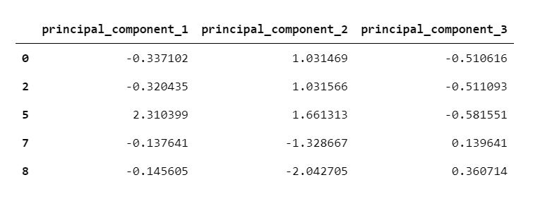
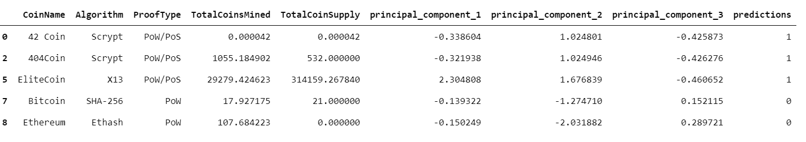
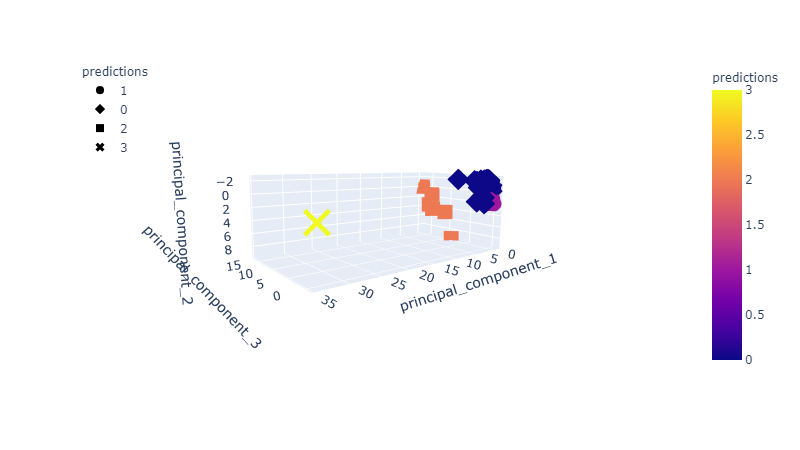
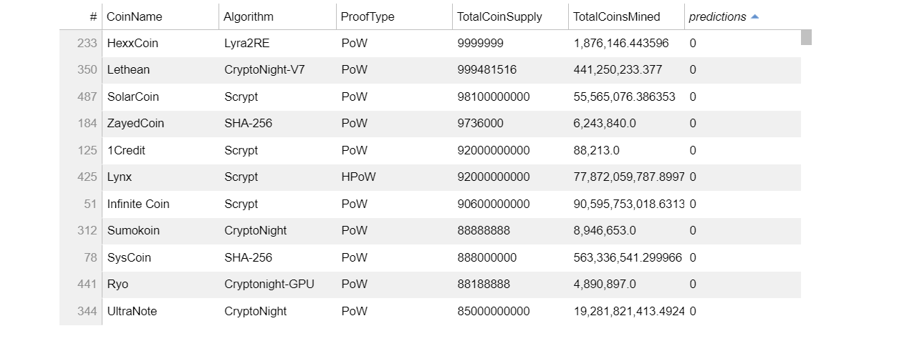
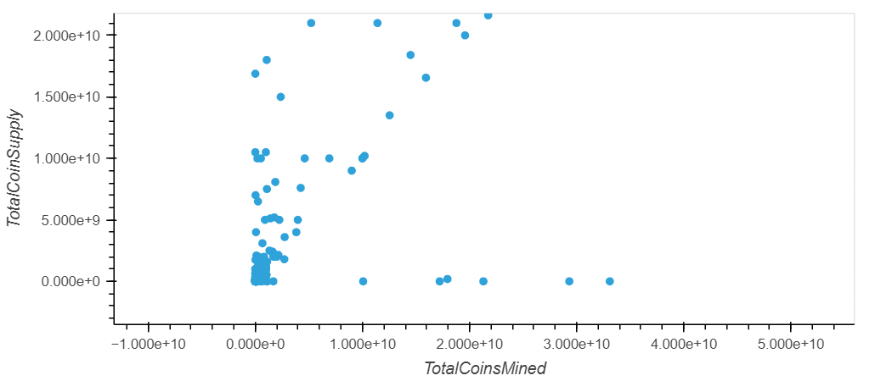

# Clustering Crypto

_[Cryptocurrencies coins by Worldspectrum](https://www.pexels.com/@worldspectrum?utm_content=attributionCopyText&utm_medium=referral&utm_source=pexels) | [Free License](https://www.pexels.com/photo-license/)_

### Background

 We want to create a cryptocurrencies investment portfolio for customers, however, the universe of cryptocurrencies is immense. To help them make sense of we generate a report of what cryptocurrencies are available on the trading market and how they can be grouped using classification.  

We use unsupervivsed learning skills into action by clustering cryptocurrencies and creating plots to present your results.

Steps to accomplish the following main tasks:

* **[Data Preprocessing](#Data-Preprocessing):** Prepare data for dimension reduction with PCA and clustering using K-Means.

* **[Reducing Data Dimensions Using PCA](#Reducing-Data-Dimensions-Using-PCA):** Reduce data dimension using the `PCA` algorithm from `sklearn`.

* **[Clustering Cryptocurrencies Using K-Means](#Clustering-Cryptocurrencies-Using-K-Means):** Predict clusters using the cryptocurrencies data using the `KMeans` algorithm from `sklearn`.

* **[Visualizing Results](#Visualizing-Results):** Create some plots and data tables to present your results.

#### Data Preprocessing

In this section, we load the information about cryptocurrencies and perform data preprocessing tasks.

1. Using the following `requests` library, retreive the necessary data from the following API endpoint from _CryptoCompare_ - `https://min-api.cryptocompare.com/data/all/coinlist`.  

2. With the data loaded into a Pandas DataFrame, continue with the following data preprocessing tasks.

3. Keep only the necessary columns: 'CoinName','Algorithm','IsTrading','ProofType','TotalCoinsMined','TotalCoinSupply'

4. Keep only the cryptocurrencies that are trading.

5. Keep only the cryptocurrencies with a working algorithm.

6. Remove the `IsTrading` column.

7. Remove all cryptocurrencies with at least one null value.

8. Remove all cryptocurrencies that have no coins mined.

9. Drop all rows where there are 'N/A' text values.

10. Store the names of all cryptocurrencies in a DataFrame named `coins_name`, use the `crypto_df.index` as the index for this new DataFrame.

11. Remove the `CoinName` column.

12. Create dummy variables for all the text features, and store the resulting data in a DataFrame named `X`.

13. Use the [`StandardScaler` from `sklearn`](https://scikit-learn.org/stable/modules/generated/sklearn.preprocessing.StandardScaler.html) to standardize all the data of the `X` DataFrame. This is important prior to using PCA and K-Means algorithms.

#### Reducing Data Dimensions Using PCA

Use the [`PCA` algorithm from `sklearn`](https://scikit-learn.org/stable/modules/generated/sklearn.decomposition.PCA.html) to reduce the dimensions of the `X` DataFrame down to three principal components.

After reducing the data dimensions, create a DataFrame named `pcs_df` using as pca columns ;  use the `crypto_df.index` as the index for this new DataFrame.

#### Clustering Cryptocurrencies Using K-Means

In this section, we use the [`KMeans` algorithm from `sklearn`](https://scikit-learn.org/stable/modules/generated/sklearn.cluster.KMeans.html) to cluster the cryptocurrencies using the PCA data.

Perform the following tasks:

1. Create an Elbow Curve to find the best value for `k` using the `df_pca`.

2. Once we define the best value for `k`, run the `Kmeans` algorithm to predict the `k` clusters for the cryptocurrencies data. Use the `df_pca` to run the `KMeans` algorithm.

3. Then create a new DataFrame named `clustered_df`, that includes the following columns `"Algorithm", "ProofType", "TotalCoinsMined", "TotalCoinSupply", "PC 1", "PC 2", "PC 3", "CoinName", "Class"`. You should maintain the index of the `crypto_df` DataFrames as is shown bellow.

    

#### Visualizing Results

In this section, we create some data visualization to present the final results. Perform the following tasks:

1. Create a 3D-Scatter using Plotly Express to plot the clusters using the `clustered_df` DataFrame. You should include the following parameters on the plot: `hover_name="CoinName"` and `hover_data=["Algorithm"]` to show this additional info on each data point.

2. Use `hvplot.table` to create a data table with all the current tradable cryptocurrencies. The table should have the following columns: `"CoinName", "Algorithm", "ProofType", "TotalCoinSupply", "TotalCoinsMined", "Class"`

3. Create a scatter plot using `hvplot.scatter`, to present the clustered data about cryptocurrencies having `x="TotalCoinsMined"` and `y="TotalCoinSupply"` to contrast the number of available coins versus the total number of mined coins. Use the `hover_cols=["CoinName"]` parameter to include the cryptocurrency name on each data point.

#### Observations:

* We can group data into 3 main clusters based on KNN classification.

 * There are some coins where there is a large mined and supply mismatch. So these coins need to be investigated more.

 
